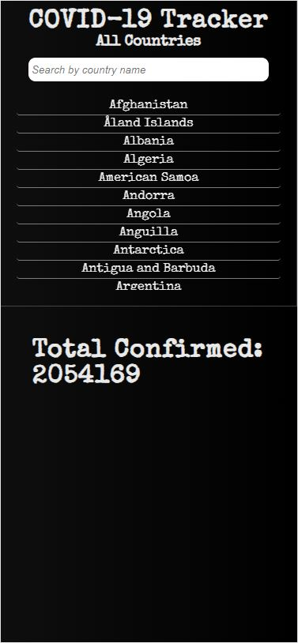
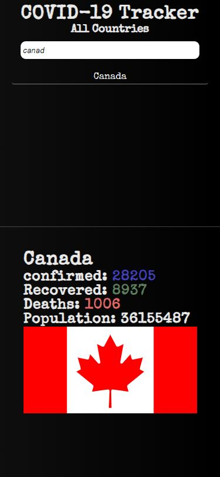

# :chart_with_upwards_trend: COVID-19 Tracker

During this pandemic, everyone was not ready for it, but we are all united and helping each other in any way possible. COVID-19 Tracker is a website to show the user on the latest updated number related to COVID-19 with some information about the country.
## MVP
    - User will be able to see all the country name
    - User will be able to search country by name
    - User will be able to click on each country and see the detail below with information about the specific country

### :triangular_ruler: Design

Very simple and dark theme with beautiful font for user to get more engage and with responsive design, user can visit the sit in any device including mobile, ipad and large displays. Split design for mobile makes user able to scroll throught country names while at current country information.

### :cd: Run Locally

- clone the repo
- npm install
- npm start

### :hammer_and_wrench: Tools Used: 
 
- React, JavaScript, HTML, CSS, GitHub
- API: 
    - Country Flags and population: restcountries.eu
    - COVID-19 data: rapidapi.com

## :desktop_computer: Try out here

[COVID19Tracker](https://covid19tracker.kevinkarma.com/)

## Screenshots

### List of Countries:

### Search Canada and details:

